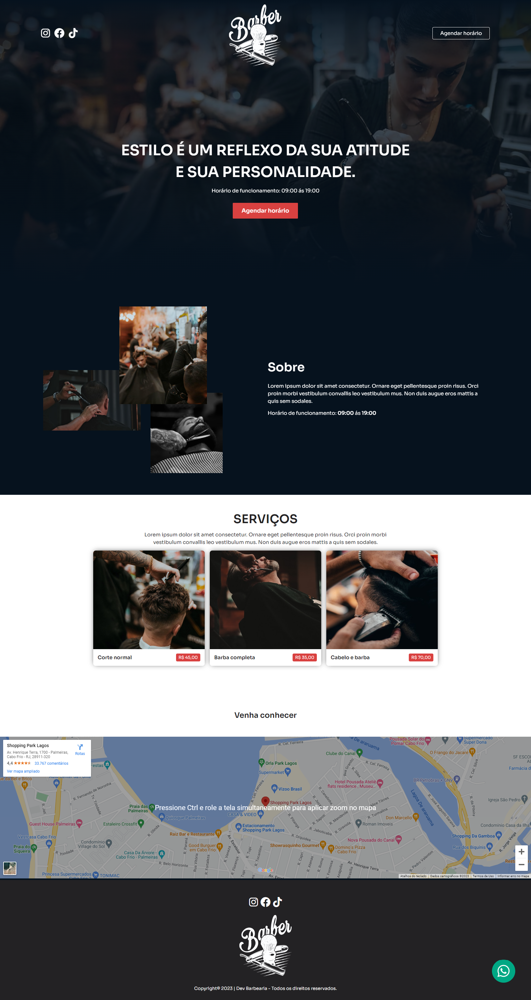

# Barber

 

### Projeto de uma Landing Page de uma Barbearia

Projeto desenvolvido aplicando os conceitos de animações, transições entre outros:
- Mobile
- Unidade de medida flexível
- Estilização utilizando SCSS
- Font customizada
- Aplicando animações e transições simples usando as keyframes.
- Aplicando animações e transições usando a biblioteca AOS -> Animate On Scroll

 

  
  

## 🚀 Tecnologias

Esse projeto foi desenvolvido com as seguintes tecnologias:

- HTML
- CSS
- SASS
- Git e Github

 

## Contato: gisellemacedo.dev@gmail.com

 
 

<h3 align="center">Feito com 💜 by Giselle</h3>